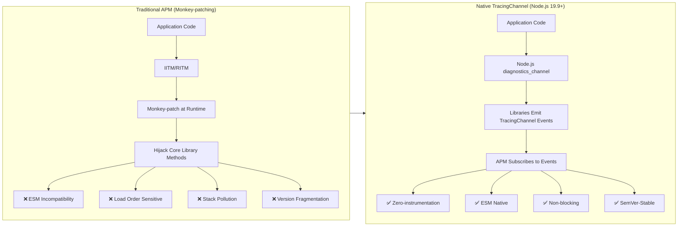
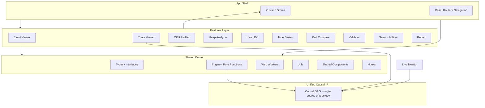

# NodeVerdict

> A browser-based **Node.js diagnostic data viewer** — consumes native `diagnostics_channel.TracingChannel` JSON events, providing event lists, waterfall charts, CPU flame graphs, heap snapshot analysis, GC log parsing, performance comparison, and report generation. All data is processed locally — nothing is uploaded to any server. An optional WebSocket Live Agent enables real-time diagnostics from running Node.js processes. Designed for development debugging and tooling validation within the TracingChannel ecosystem.


[](LICENSE)
[](https://snowleopard-io.github.io/NodeVerdict/)

---

## Table of Contents

- [Why NodeVerdict](#why-nodeverdict)
- [Features](#features)
- [Getting Started](#getting-started)
- [Usage](#usage)
- [Architecture](#architecture)
- [Examples](#examples)
- [Browser Support](#browser-support)
- [Development](#development)
- [FAQ](#faq)
- [Ecosystem & Timing](#ecosystem--timing)
- [License](#license)

---

## Why NodeVerdict

The Node.js observability ecosystem is undergoing a **paradigm shift at the infrastructure level**. Existing APM tools rely on `import-in-the-middle` (IITM) and `require-in-the-middle` (RITM) to monkey-patch libraries — a fragile approach that breaks under ESM, conflicts with bundlers, and requires SDK initialization before any library is loaded.

Since Node.js 19.9, the built-in `diagnostics_channel.TracingChannel` API allows libraries to natively emit structured `start`/`end`/`asyncStart`/`asyncEnd`/`error` events. APM tools can subscribe directly — no patching required.

**NodeVerdict is built for this migration.** When mainstream libraries (mysql2, ioredis, pg, Express, etc.) natively support TracingChannel, the community needs an interactive frontend to consume and visualize these diagnostic events. The production side of the ecosystem is being built rapidly; the consumption side is still a blank canvas.



---

## Features

### 1. Diagnostic Event Viewer

Upload a JSON file of TracingChannel events and explore them in an interactive timeline.

- **Timeline View** — Chronological event list with color-coded channels
- **Channel Filter** — Filter by channel name (e.g., `mysql2:query`, `ioredis:command`)
- **Event Detail Panel** — Click any event to inspect its full context with smart rendering (SQL syntax highlighting, HTTP method badges, error stack traces, Redis command display)
- **Operation Aggregation** — Paired `start`/`end` events show complete operation duration and status


### 2. Trace Waterfall View

Visualize async operation chains using `asyncStart`/`asyncEnd` events.

- **Waterfall Chart** — D3.js-powered horizontal bar chart showing nested async operations, similar to Chrome DevTools Performance panel
- **Dependency Graph** — Causal relationships between operations (e.g., "Query A waits for pool connection → connection established → query executed")
- **Bottleneck Detection** — Automatically identifies P95+ slow operations


### 3. CPU Profiler (NEW)

Upload `.cpuprofile` files from Node.js (`--cpu-prof`) or Chrome DevTools to visualize CPU usage.

- **Interactive Flame Graph** — D3.js-powered flame graph with click-to-zoom, hover tooltips, and zoom history navigation
- **Hot Functions Table** — Sortable by Self Time or Total Time, showing hit counts and source file locations
- **Call Stack Visualization** — Full call tree traversal with colorful function blocks proportional to CPU time
- **Realistic Sample Data** — Includes `examples/cpu-profile-sample.cpuprofile` with typical Express app traffic patterns


### 4. Heap Snapshot Analyzer

Upload `.heapsnapshot` files from Node.js for memory analysis.

- **Hot Objects List** — Top objects sorted by retained size
- **Leak Detection** — Three rules automatically flag suspicious objects: unbounded cache growth, closure-captured large objects, event listener accumulation
- **GC Root Path** — Simplified path display from GC roots to selected objects


### 5. Heap Snapshot Diff (NEW)

Compare two `.heapsnapshot` files side-by-side to identify memory growth and new objects.

- **Dual Upload Panel** — Upload "before" and "after" snapshots independently
- **Delta Summary Cards** — Size Before/After, Size Delta, Object Delta
- **New / Growing / Removed** — Three categorized lists showing newly created object types, growing constructors, and freed types
- **Full Diff Table** — Sorted by absolute size delta, showing count and size changes for each constructor type


### 6. Time Series Analysis (NEW)

Visualize event throughput, latency distribution, and performance trends over time.

- **Throughput Chart** — D3.js bar chart showing events per time bucket, with error markers overlaid in red
- **Latency Distribution** — Histogram showing operation duration distribution (30 buckets)
- **Channel Latency Breakdown** — Table with P50, P95, P99, min, max, and average latency per channel
- **Summary Metrics** — Events/second throughput, average latency, P95 latency


### 7. Performance Comparison (NEW)

Compare two sets of tracing data to identify performance regressions or improvements.

- **Dual Dataset Upload** — Load "before" and "after" tracing event JSON files
- **Side-by-side Statistics** — Events, operations, error rate, and total duration for each dataset
- **Channel Comparison Table** — Per-channel average latency, delta, percentage change, and error count comparison
- **Visual Indicators** — Red for regressions (>5% slower), green for improvements (>5% faster)


### 8. Event Validator

For library maintainers and APM tool developers to verify TracingChannel implementation correctness.

- **Naming Convention Check** — Validates `{package}:{operation}` pattern
- **Required Field Validation** — Ensures context includes semantic fields (e.g., `db.query.text`, `server.address`)
- **Event Pairing Check** — Verifies every `start` has a matching `end`/`error`
- **Compatibility Check** — Validates alignment with OpenTelemetry semantic conventions


### 9. Search & Filter (NEW)

Advanced search and filtering across all tracing events.

- **Full-text Search** — Searches channel, context, and operationId fields
- **Regex Support** — Toggle regex mode for advanced pattern matching
- **Case-sensitive Toggle** — Control case sensitivity
- **Duration Range Filter** — Filter operations by min/max duration
- **Status Filter** — Filter by success, error, or incomplete operations
- **Time Range Filter** — Numerical timestamp range filtering
- **Real-time Results** — Live count of matching vs total events


### 10. Shareable Diagnostic Reports

Generate compressed reports encoded in the URL — share via GitHub Issues, Slack, or documentation.

- **Zero Infrastructure** — Reports are encoded in the URL hash using `lz-string` compression
- **One-Click Copy** — Copy the shareable link with a single button
- **Key Findings** — Auto-generated summaries (e.g., "mysql2:query avg 120ms, P95 450ms")
- **Offline HTML Export (NEW)** — Download a standalone HTML file with all data and charts embedded, styled like a professional report, no server needed to view


### 11. Memory Timeline (NEW)

Upload `process.memoryUsage()` time series data to visualize memory growth trends over time.

- **D3.js Line Chart** — Three overlaid lines (RSS, heapUsed, external) with relative time axis (seconds) and MB scale
- **Growth Rate Alert** — Linear regression calculation to detect abnormal memory growth (>1 MB/s flagged as anomaly)
- **Data Table** — Scrollable detail table of all memory snapshots for precise inspection


### 12. GC Log Analyzer (NEW)

Parse V8 `--trace-gc` log files to analyze garbage collection behavior and external memory pressure.

- **GC Statistics Cards** — Total GC events, Major (Mark-sweep) count, Minor (Scavenge) count, total pause time
- **External Memory Warning** — Flags heap growth >50MB as potential unmanaged memory
- **Event Table** — Chronological list of all GC events with type, pause time, and heap size delta


### 13. Live Monitor (NEW)

Connect to a running Node.js process in real-time via WebSocket — no restart, no dump file needed.

- **Real-time Memory Polling** — RSS, heapUsed, heapTotal, external displayed on live-updating StatCards
- **Live TracingChannel Events** — Streaming event display with channel badges and timestamps
- **On-demand Diagnostics** — Take heap snapshot or CPU profile at any time, download as files
- **Agent Protocol** — Uses the `NodeVerdict Live Agent` (`server/live-agent.mjs`) which subscribes to `diagnostics_channel` events and inspector APIs


### 14. Alert Rules (NEW)

Define threshold rules over trace/heap metrics and see exactly which rules are firing.

- **Six Metrics** — `heapUsedPercent` (%), `externalMemory` (MB), `heapGrowthRate` (MB/s), `rssGrowthRate` (MB/s), `errorRate` (%), `eventRate` (evt/s)
- **Three Levels** — `info` / `warning` / `critical` with color-coded badges, border highlights, and a firing state that lights up when a rule is violated
- **Rule Builder** — Add/remove rules with a metric, comparison operator, threshold, and level; a default rule (`heapUsedPercent > 85`, warning) is included
- **Recently Fired** — Rules are evaluated against the current metric snapshot; every firing rule is listed with its actual value and message, and can be cleared with one click


### 15. Tutorial

Built-in interactive guide covering how to generate diagnostic data from Node.js projects and use all NodeVerdict features.

- **Markdown-based** — Step-by-step instructions with code examples for TracingChannel, CPU profiling, heap snapshots, and more
- **Feature Walkthrough** — Detailed usage guides for every page in the app
- **Sample File Reference** — Complete table of all 17 example files with recommended learning path


### 16. AI Root Cause Analysis (NEW)

One-click root-cause diagnosis powered by an LLM (or local heuristics when no API key is set).

- **Trace-to-Prompt** — Converts any trace into a compact structured prompt preserving span topology, timing shares, and error chains
- **Ecosystem-aware Reasoning** — System prompt embeds a Node.js knowledge base (connection pools, event-loop blocking, N+1, Redis KEYS, etc.) so the model reasons against real library behavior
- **Streaming Output** — Markdown analysis streams into the page as it is generated
- **Bring Your Own Key** — Any OpenAI-compatible endpoint; the key stays in your browser's localStorage
- **Local Fallback** — A heuristic analyzer (dominant channel, deepest error, most expensive span) works with zero configuration


### 17. OpenTelemetry Import & .ndv Binary Format (NEW)

- **OTel-native** — Drop in a standard OTLP/JSON trace export (or jaeger-style JSON) and every page auto-detects and converts it to the internal event model. No Jaeger/collector needed.
- **Compact `.ndv` Format** — Export traces as a memory-map friendly binary (~45% the size of JSON). The Trace Viewer imports/exports `.ndv`; the layout is designed so a Rust/WASM decoder can read the same buffer.
- **Shared Loader** — One loader normalizes all three sources (NodeVerdict JSON, OTel JSON, `.ndv`) across every feature.

### 18. Performance Gate CLI (NEW)

Turn traces into a CI gate.

- **`node-verdict check`** — CLI with exit codes (`0` pass, `1` fail, `2` error) for easy CI integration
- **Rules as code** — Configurable thresholds for P99 latency, N+1 SQL patterns, and event-loop delay
- **GitHub Actions** — `.github/workflows/perf-gate.yml` runs the gate on every PR and posts a diff-style report as a PR comment
- **Outputs** — Human-readable markdown or `--json` for machine consumption

### 19. NodeVerdictExporter SDK (NEW)

Stream OTel spans from your running Node.js service directly into the viewer.

- **`nodeverdict-exporter`** — OpenTelemetry `SpanProcessor` / `SpanExporter` that converts completed spans into NodeVerdict `TracingEvent[]` and streams them to a callback
- **One-liner setup** — `startNodeVerdict({ serviceName, onExport })` registers a global `NodeTracerProvider`
- **Formats** — Native events JSON or OTLP/JSON output, both directly importable in the browser
- See [`exporter/README.md`](./exporter/README.md) for the full guide.

### 20. Service Topology & Distributed Root Cause (NEW)

Turn cross-service OTel traces into a live dependency map and a ranked root-cause verdict — fully in the browser.

- **Span-tree reconstruction** — Parses `trace_id` / `span_id` / `parent_span_id` from OTel exports and rebuilds per-trace span trees; multi-trace span-ID reuse is handled safely
- **Logical-clock skew correction** — Cross-host wall-clock drift is corrected with a Lamport-style re-anchoring pass (durations are preserved; causality is enforced), so event ordering is trustworthy even with millisecond-level clock skew
- **Service dependency graph** — Nodes are services, edges are caller→callee calls, aggregated with call frequency, P50/P95/P99 latency, and error rate; nodes are colored healthy / warning / faulty
- **Force-directed rendering** — D3-force simulation drawn on `<canvas>` (labels appear on hover when the graph is large), built to stay at 60fps for 100+ services; click a node to inspect metrics and dependencies
- **Root-cause localization** — Combines critical-path analysis, unexplained-self-time anomaly detection, error signal, and a reverse personalized PageRank over the dependency graph into a ranked hypothesis list with a **confidence score**
- **Cascade impact chain** — Shows the causal chain ("service A latency ↑ → service B timeout → service C queue backlog") and actionable fix recommendations (e.g. connection-pool exhaustion)
- **Trace Viewer linkage** — "Open traces in Trace Viewer" jumps to the existing waterfall for the same dataset


### 21. Streaming Large-File Import (NEW)

Never `JSON.parse` a multi-GB file again. Large trace files are parsed incrementally in a dedicated Web Worker so the UI thread is never blocked and memory stays bounded.

- **True streaming** — Reads via `file.stream().pipeThrough(new TextDecoderStream())` instead of `FileReader.readAsText()`, so a 200MB file never exists as a single in-memory string
- **Incremental JSON tokenizer** — `IncrementalJsonParser` is a resumable state machine that emits each complete top-level `{...}` the moment its closing brace arrives, no matter where chunk boundaries fall (mid-string, mid-escape, mid-number, or split multi-byte UTF-8). Memory is bounded by the *largest single event*, not the file size
- **Incremental analyzer** — `StreamingTraceAnalyzer` mirrors the `Normalize → Pair → Stats` pipeline but consumes events one at a time: pairing is done with a streaming `startMap`, channel stats accumulate into per-channel duration arrays, and aggregates cover the *entire* file
- **Worker + zero main-thread blocking** — parsing runs in a module worker; progress (`%`, events seen) is relayed back every ~100ms and the UI stays at 60fps
- **Bounded retention** — Full `events[]` / `operations[]` arrays are capped (250k each by default) so peak memory stays under control; channel stats, error rate, and time range are always computed over 100% of events, and a notice appears when the view is truncated
- **Auto-routing** — `useStreamingTraceFile` is a drop-in for `useFileUpload`: files under 10MB use the existing in-memory path (identical behavior, OTel/ndv support), larger files stream through the worker
- **Verification** — `test/streaming-bench.perf.test.ts` runs a streaming-vs-in-memory parity + timing benchmark (`BENCH_STREAM=1 npx vitest run test/streaming-bench.perf.test.ts`); on a 21MB / 200k-event file the streaming pipeline completes in ~0.5s wall time with identical aggregates

> **Roadmap** — the same interface is designed so the tokenizer/analyzer core can later be swapped for a Rust + WASM implementation (`wasm-bindgen` + `serde`) to push raw throughput toward the 200MB/5s target; streaming, worker, retention, and progress plumbing stay unchanged.

### 22. Differential Debug (NEW)

Compare a *normal* and a *fault* execution trace of the same code path to localize exactly where and why the two runs diverged — the debugging analog of a git diff for execution traces.

- **Band-limited alignment** — The two event streams are aligned with a banded dynamic-programming edit-distance aligner (common-prefix/suffix trim + O(band) memory) so 100k-event traces align in well under a second
- **Run-specific noise ignored** — Timestamps, request/trace/span/session IDs, and `now()`/`hrtime` values are excluded by default so uninteresting deltas don't produce false divergences
- **Cause vs. effect** — The first divergence region is classified as the **cause**; later same-channel or error-bearing regions are **effects**, each with a 0–1 confidence score and a human-readable reason
- **Variable & stack diffs** — Every divergence shows the aligned event pair side-by-side plus per-key value diffs and per-frame stack diffs
- **Natural-language report** — A generated summary and ordered fix recommendations (e.g. "the fault run reads 512 bytes where the normal run reads 1024 — check the DB connection pooling config")


- **JIT Insights** — Parse combined V8 `--trace-ic` / `--trace-opt` / `--trace-deopt` output into inline-cache sites, hidden-class (map) flow, and optimize/deoptimize timelines; visualize IC polymorphism as a force-directed graph; detect JIT anti-patterns (megamorphic ICs, deopt storms, optimize/deopt loops, hidden-class fragmentation, optimization suppression) scored by severity with an overall health score. A semantic patch engine rewrites object-literal / field-initialization order to unify hidden classes, each verified by an `@babel/parser`-based AST-equivalence checker, and a fully end-to-end flow maps each finding back to the function in your uploaded source, applies the AST-verified fixes, and lets you download the rewritten file. Sample trace/source: `examples/v8-jit-trace.log` + `examples/demo.js`.


### 23. Snapshot History (NEW)

Track heap snapshot comparison results over time to identify memory trends. Every comparison you save in the Heap Diff view is recorded here as a history entry, letting you watch retained size, node counts, and growth rates across successive snapshots.

- **Trend chart** — A d3 line chart of retained-size deltas over each recorded comparison, with red growth / green improvement points and a dashed zero line
- **Leak pattern detection** — Flags monotonic-growth runs as a **memory leak**, shrinking runs as healthy, with an auto-generated description of the detected pattern
- **Summary stats** — Total comparisons, average growth rate, total new nodes, and the number of flagged (leaking) records
- **Full history table** — ID, timestamp, label, before/after sizes, retained Δ, and growth rate per recorded comparison
- **Import / clear** — Import a history file (e.g. `examples/snapshot-history.json`) to load prior runs, or clear all records


### 24. Streaming Causal Graph Reconstruction (NEW)

Turn a flat, possibly-broken stream of TracingChannel events into a **causal DAG** — *why* things happen, not just *when*.

- **Streaming / incremental** — `CausalGraphBuilder.ingest()` accepts events one at a time (Live agent, streaming worker); `build()` can be called repeatedly as the trace arrives, so a partially-usable graph is always available
- **Causality, not just time** — edges come from explicit parent ids (`parentOperationId`/`parentSpanId`), `asyncId`→`triggerAsyncId` matching, or interval containment; out-of-order arrivals are re-paired instead of rejected
- **Confidence + gap healing** — every edge carries `high`/`medium`/`low` confidence; missing ancestors are back-filled as *virtual* nodes so the topology stays connected without inventing real operations
- **Loop detection** — a valid causal DAG is acyclic; DFS finds back edges, flags the involved nodes, and reports the cycle
- **Orphan semantics** — a node is an orphan only when a *declared* relationship is broken (missing parent / end-without-start); a genuine root is not an orphan

### 25. Real-time Streaming RCA (NEW)

Root-cause inference that runs on a *partial* trace — verdicts arrive while data is still streaming in, with uncertainty made explicit.

- **Incremental blame** — a fixed-point influence pass over the partial DAG (child→parent) seeded by per-node anomaly; recomputes in O(edges) per snapshot
- **Temporal sliding window** — each sample carries an end timestamp; only `[now − windowMs, now]` counts as "recent", so a latency/error spike is measured against an all-time baseline
- **Signals** — `latency-spike` (own duration vs 25th-percentile baseline), `error-rate-spike` (window vs all-time error fraction), `high-error-count`, `incomplete-open-span`
- **Uncertainty labeling** — open (unclosed) spans carry a penalized confidence; overall confidence scales with how much closed evidence has accumulated
- **Early warnings** — coarse channel-level alerts (`critical`/`warning`) generated independently of the graph, before a precise verdict is possible

### 26. Trace-to-Code Reverse Mapping (NEW)

Link every stack frame back to the *authored* source — no manual `node_modules/...:234:5` archaeology.

- **Source Map V3 resolver** — dependency-free base64-VLQ decoder (`src/shared/source/source-map-resolver.ts`) with forward (generated→original) and reverse (original→generated) lookups
- **V8 stack parser** — handles both `at fn (file:line:col)` and bare `at file:line:col` forms
- **Node.js C++ / built-in filtering** — `node::...`, `* internalBinding *`, `node:internal/...`, `[eval]` frames are surfaced (not hidden) as filtered, while `node_modules` stays app code
- **File System Access bridge** — pick a project root once, read `.map` files on demand; degrades to a no-op stub on unsupported contexts

### 27. Elastic Alignment & Noise Suppression (NEW)

Two runs of identical code still diverge by GC pauses, DNS/TCP setup and timer jitter. This layer separates *jitter* from *regression* before anything gets reported.

- **Noise model** — `src/shared/differential/noise-model.ts` detects and masks GC pauses, timer jitter, DNS/TCP setup, and wide idle inter-event gaps, independently per trace
- **Semantic differ** — drops masked divergences and trivial value-only churn; keeps error-introduced / stack-change / inserted / missing / channel-sequence (path-changing) differences
- **Regression scoring** — `severity = confidence × impact`: confidence is the share of structural changes, impact blends mean significance with channel breadth; `minDeltaMs` adds a second anti-noise floor
- **Backward compatible** — the full pipeline runs when you pass `{ regression: {} }` to `analyzeDifferential`; without it, behaviour is unchanged

### 28. Viewport-Culled Virtual-Scroll Waterfall (NEW)

The waterfall is no longer a `N × 3`-node SVG that freezes on 100k spans.

- **Viewport culling** — only the rows inside `[scrollTop, scrollTop + viewportHeight]` (plus an overscan buffer) are rendered; DOM count is O(visible), independent of total span count
- **Zero-visual-change** — still D3 SVG, same look; a small footer shows `Showing {shown} of {total} spans (viewport)`
- **Deliberately scoped** — row virtualization only; no WebGL/Canvas rewrite, no LOD down-sampling (a waterfall's bottleneck is row count, not horizontal density)

---

## Getting Started

### Prerequisites

- Node.js 18+
- npm 9+

### Installation

```bash
git clone https://github.com/your-username/node-verdict.git
cd node-verdict
npm install
```

### Development

```bash
npm run dev
```

Open [http://localhost:5173/node-verdict/](http://localhost:5173/node-verdict/) in your browser.

### Production Build

```bash
npm run build
npm run preview
```

The static build output is in the `dist/` directory, ready to deploy to GitHub Pages or any static hosting.

---

## Usage

### 1. Prepare Your Diagnostic Data

TracingChannel events should be exported as a JSON array. Each event follows this structure:

```typescript
interface TracingEvent {
  channel: string;           // e.g., "mysql2:query"
  eventType: 'start' | 'end' | 'asyncStart' | 'asyncEnd' | 'error';
  context: Record<string, any>;  // library-specific context
  timestamp: number;
  duration?: number;
  error?: { message: string; stack?: string; name?: string };
  operationId?: string;      // for cross-event correlation
}
```

CPU profile files should be exported from Node.js using `--cpu-prof` flag or Chrome DevTools' CPU profile export.

Heap snapshots should be generated using `node --heapsnapshot-signal` or `v8.writeHeapSnapshot()`.

### 2. Upload & Explore

Navigate to any feature page, upload your diagnostic file, and start exploring:

| Page | Data Type | Best For |
|------|-----------|----------|
| **Event Viewer** | Tracing events JSON | Browsing individual events, filtering by channel, smart context inspection |
| **Trace Viewer** | Tracing events JSON | Understanding async operation chains and bottlenecks |
| **CPU Profiler** | `.cpuprofile` | Finding hot functions, flame graph visualization |
| **Heap Analyzer** | `.heapsnapshot` | Memory leak investigation, hot object analysis, string analysis |
| **Heap Diff** | `.heapsnapshot` (×2) | Comparing memory before/after to find growth |
| **Time Series** | Tracing events JSON | Throughput and latency distribution over time |
| **Perf Compare** | Tracing events JSON (×2) | A/B performance comparison, regression detection |
| **Validator** | Tracing events JSON | Debugging TracingChannel library implementations |
| **Search & Filter** | Tracing events JSON | Full-text search, regex, duration/status filtering |
| **Report** | Tracing events JSON | Generating shareable diagnostic summaries |
| **Memory Timeline** | `memory-timeline.json` | Visualizing RSS/heap/external memory growth trends |
| **GC Log Analyzer** | `--trace-gc` log files | Analyzing GC pause times and external memory pressure |
| **Live Monitor** | WebSocket (live) | Real-time memory monitoring, on-demand heap/CPU diagnostics |
| **Alert Rules** | Tracing events JSON / heap | Threshold monitoring (memory %, growth rates, error/event rates) |
| **AI Root Cause** | Tracing events JSON / OTel / `.ndv` | LLM or local-heuristic root-cause analysis |
| **Tutorial** | Built-in MD guide | Learning how to generate and use diagnostic data |

### 3. AI Root Cause Analysis

Diagnose a trace in one click:

1. **Upload a trace** — a NodeVerdict `TracingEvent[]` JSON, an OpenTelemetry export, or a `.ndv` file.
2. Click **AI Diagnose**. The first time, the **Configure API key** dialog opens — enter any OpenAI-compatible endpoint (Base URL), model, and API key. The key is stored only in your browser's localStorage and sent directly to the endpoint.
3. The analysis **streams in as markdown** — symptom, key evidence, root cause, recommended fixes (grounded in the embedded Node.js ecosystem knowledge base), and confidence.
4. No API key? Click **Local heuristic analysis** — it reports the dominant-cost channel, the deepest error in the span tree, and the most expensive span with zero configuration.

> Privacy: only the trace summary you choose to send leaves the browser. The raw data never does.

### 4. Performance Gate (CI)

Check a trace against performance rules from the command line.

**How to start the CLI** — three equivalent ways:

```bash
# 1. Direct (no install, works in this repo)
npm run build:cli                          # bundle cli/check.mjs (also runs via npm run build)
node cli/check.mjs check examples/tracing-perf-before.json

# 2. Local npm bin (no global install)
npm exec -- node-verdict check examples/tracing-perf-before.json

# 3. Install the `node-verdict` command globally (then use it anywhere)
npm install -g .                            # or: npm link
node-verdict check examples/tracing-perf-before.json
node-verdict --version                      # → 1.0.0
node-verdict check --help                   # full options
```

Exit codes: `0` = pass, `1` = fail, `2` = error. Override thresholds with a config file or flags:

```bash
node cli/check.mjs check examples/tracing-perf-before.json --config gate.json
node cli/check.mjs check trace.ndv --threshold=p99MaxMs=250 --json --report gate-report.md
```

Example `gate.json`:

```json
{ "p99MaxMs": 500, "n1SqlMaxCount": 3, "eventLoopDelayMaxMs": 20 }
```

The included [`.github/workflows/perf-gate.yml`](./.github/workflows/perf-gate.yml) runs the gate on every PR and posts the report as a PR comment.

### 5. Stream From OpenTelemetry

Use the exporter SDK in your Node.js service and open the output in any NodeVerdict page:

```bash
cd exporter && npm install
```

```ts
import { startNodeVerdict } from 'nodeverdict-exporter';

startNodeVerdict({ serviceName: 'api', onExport: (events) => console.log(JSON.stringify(events)) });
```

You can also drop a saved OTLP/JSON export (or jaeger-style JSON) straight into any page — the loader auto-detects the format.

### 6. Share Results

Click **Report** → **Copy Link** to share your analysis as a URL. Recipients open the link and see the same results — no server, no installation.

For more comprehensive sharing, use the **Download HTML Report** button to export a standalone, self-contained HTML report file.

---

## Architecture

```
src/
├── shared/                          # Kernel (framework-agnostic)
│   ├── types/                       # TypeScript type definitions
│   │   ├── tracing.ts               # TracingChannel event types
│   │   ├── heap.ts                  # Heap snapshot types
│   │   ├── cpu-profile.ts           # CPU profile & flame graph types
│   │   ├── memory.ts                # Memory analysis types
│   │   └── report.ts                # Report data types
│   ├── engine/                      # Pipeline parsing engine (pure functions)
│   │   ├── tracing-parser.ts        # Tracing event parsing pipeline
│   │   ├── trace-aggregator.ts      # Waterfall building & bottleneck detection
│   │   ├── data-loader.ts           # Unified loader: NodeVerdict JSON / OTel / .ndv
│   │   ├── otel-adapter.ts          # OTLP/JSON → TracingEvent conversion
│   │   ├── ndv-codec.ts             # Compact .ndv binary codec (WASM-ready layout)
│   │   ├── heap-parser.ts           # Heap snapshot parsing
│   │   ├── heap-diff.ts             # Heap snapshot comparison engine
│   │   ├── memory-analyzer.ts       # String/external memory/GC log analysis
│   │   ├── cpu-profile-parser.ts    # CPU profile parsing & flame tree building
│   │   ├── validator.ts             # Event format validator
│   │   ├── report-generator.ts      # Report generation & compression
│   │   ├── causal-rebuilder.ts      # Streaming causal DAG builder (Feature 24)
│   │   └── jit-analysis.ts          # V8 IC / deopt / hidden-class analysis
│   ├── streaming/                   # Live / incremental analysis
│   │   └── streaming-rca.ts         # Partial-DAG streaming RCA (Feature 25)
│   ├── source/                      # Source & code mapping
│   │   ├── source-map-resolver.ts   # Dependency-free V3 source-map decoder
│   │   ├── code-linker.ts           # V8 stack → source-frame linker
│   │   └── fs-access-bridge.ts      # File System Access API bridge (Feature 26)
│   ├── differential/                # A/B regression analysis
│   │   ├── noise-model.ts           # GC/timer/DNS noise masking (Feature 27)
│   │   ├── semantic-differ.ts       # Semantic divergence filtering
│   │   └── regression-scoring.ts    # Confidence × impact regression scoring
│   ├── ai/                          # AI root-cause engine
│   │   ├── tracePrompt.ts           # Trace-to-prompt converter
│   │   ├── rcaEngine.ts             # LLM client + local heuristic analyzer
│   │   └── knowledge.ts             # Node.js ecosystem best-practice knowledge base
│   ├── gate/                        # CI performance-gate rules engine (shared with CLI)
│   │   └── performance-gate.ts      # Metrics + rules + report formatting
│   ├── workers/                     # Web Worker factory & handlers
│   ├── utils/                       # Formatting, I/O, helpers
│   ├── components/                  # Shared UI components
│   └── hooks/                       # Shared React hooks
├── features/                        # Feature modules (self-contained)
│   ├── event-viewer/                # Diagnostic Event Viewer
│   ├── trace-viewer/                # Waterfall & bottleneck analysis
│   ├── cpu-profiler/                # CPU Profile & flame graph
│   ├── heap-analyzer/               # Heap snapshot analyzer (incl. string/external memory)
│   ├── heap-diff/                   # Heap snapshot comparison
│   ├── time-series/                 # Time series & throughput analysis
│   ├── perf-compare/                # A/B performance comparison
│   ├── memory-timeline/             # Memory usage timeline chart
│   ├── gc-log/                      # GC log parser & analyzer
│   ├── live-monitor/                # Live WebSocket agent monitor
│   ├── validator/                   # Event format validator
│   ├── search-filter/               # Advanced search & filtering
│   ├── tutorial/                    # Interactive markdown tutorial
│   └── report/                      # Report generation & sharing
├── stores/                          # Zustand state management
└── app/                             # App shell, entry point, navigation
```



### Key Design Patterns

| Pattern | Description |
|---------|-------------|
| **Pipeline Engine** | `Normalize → Pair → Stats → Index` — each stage is a pure function, independently testable |
| **Unified Causal IR** | The causal DAG is the single source of topology — waterfall spans and parent-child dependency links derive from its edges (each carrying `edgeKind`/`edgeConfidence`), not from separate containment heuristics |
| **Store Slice** | Each feature registers its slice in a central Zustand store — no circular dependencies |
| **Worker Factory** | Type-safe generic worker client generated from handler functions |
| **Feature Isolation** | Each feature owns its components and logic, sharing only through the store |

---

## Examples

Sample data files are available in the [`examples/`](./examples) directory:

| File | Description | Try It On |
|------|-------------|-----------|
| `examples/tracing-events.json` | mysql2 + ioredis mixed events with a deadlock error | Event Viewer, Trace Viewer |
| `examples/tracing-multi-lib.json` | pg + KafkaJS + Express cross-library trace | Trace Viewer, Report |
| `examples/tracing-invalid.json` | Malformed data: orphan events, duplicate starts, bad naming | Validator |
| `examples/tracing-http-errors.json` | HTTP error scenarios (404/403/400/500, timeout, payload too large) | Event Viewer, Validator, Report |
| `examples/tracing-search-filter.json` | 40+ events across 8 channels: varied durations, errors, and statuses for search/filter testing | Search & Filter, Event Viewer |
| `examples/tracing-cross-lib.json` | Complex cross-library async chain: Express → Auth → Redis → MySQL → Kafka | Trace Viewer, Event Viewer |
| `examples/tracing-time-series.json` | Timestamp-spread events across 14 operations for throughput and latency distribution analysis | Time Series, Event Viewer |
| `examples/tracing-perf-before.json` | Baseline tracing data: 5 requests with untuned queries (slow JOIN, SELECT *, no cache) | Perf Compare, Trace Viewer |
| `examples/tracing-perf-after.json` | Optimized version: query improvements, column selection, 7-day filter, ~40-50% latency reduction | Perf Compare, Trace Viewer |
| `examples/cpu-profile-sample.cpuprofile` | 400-sample CPU profile simulating Express app with DB queries, auth, and caching | CPU Profiler |
| `examples/heap-sample.heapsnapshot` | Minimal 5-node heap snapshot chain (AppCache → DataStore → SessionManager → LargeBuffer) | Heap Analyzer |
| `examples/heap-express-app.heapsnapshot` | Realistic Express app heap: closures, event listeners, large buffers, cache entries | Heap Analyzer, Heap Diff |
| `examples/heap-diff-before.heapsnapshot` | Before snapshot: 11 nodes with small cache (2 entries) and session store | Heap Diff |
| `examples/heap-diff-after.heapsnapshot` | After snapshot: 18 nodes with grown cache (4 entries) + leaked event listeners | Heap Diff |
| `examples/heap-string-leak.heapsnapshot` | 22-node heap with concatenated strings, sliced strings, and large string cache to test string analysis | Heap Analyzer |
| `examples/memory-timeline.json` | 16-point process.memoryUsage() time series showing steady external/RSS/heap growth over 15s | Memory Timeline |
| `examples/memory-timeline-leak.json` | 61 snapshots over 60s of an unbounded session-cache leak: heap +7.9 MB/s, RSS +10 MB/s (flags abnormal growth) | Memory Timeline |
| `examples/gc-trace-gc.log` | 33 GC events (Scavenge + Mark-sweep) over 15 seconds, showing 4x heap growth | GC Log Analyzer |
| `examples/gc-memory-leak.log` | 60s of GC with a progressive heap leak: 11 major GCs at escalating frequency, growing pauses (avg ~59ms), +315MB growth | GC Log Analyzer |
| `examples/otel-distributed-trace.json` | 7-service OTel export (api → auth → users-db, order → inventory → inventory-db, payment-gateway) with injected clock skew and a connection-pool-exhausted failure on payment-gateway | Service Topology |
| `examples/otel-cascade-failure.json` | 12-service OTel export (2 checkout traces) with a cascading failure: payment-gateway 502 error + slow recommendation/cart-db/inventory-db → api 500 | Service Topology |
| `examples/tracing-large.json` | ~427k events / 64MB trace file — large enough to route through the Streaming Large-File Import worker (files ≥10MB) | Streaming Import, Event Viewer |
| `examples/differential-normal.json` | Healthy run: 5 GET /api/users requests, all 200, 1024-byte socket reads | Differential Debug |
| `examples/differential-fault.json` | Same code path with an injected DB connection-lost bug: request req-004 reads 512 bytes, throws `mysql2:query error`, returns 500 | Differential Debug |
| `examples/differential-timeout-normal.json` | Healthy run: 5 GET /api/orders requests; upstream calls complete in ~50ms, all 200 | Differential Debug |
| `examples/differential-timeout-fault.json` | req-004's upstream call times out after 5000ms → `TimeoutError`, HTTP 504 | Differential Debug |
| `examples/differential-pool-normal.json` | 6 GET /api/orders requests, each acquires and releases a pool connection | Differential Debug |
| `examples/differential-pool-fault.json` | req-005's connection is never released (leak) → req-006 times out waiting, HTTP 503 | Differential Debug |
| `examples/differential-cache-normal.json` | GET /api/orders: first request warms the cache, next 4 hit it (no DB query) | Differential Debug |
| `examples/differential-cache-fault.json` | Cache set is skipped (bug) so every request misses and hits the DB — `cacheHit` flips and extra queries appear | Differential Debug |

### Quick Start Guide

**New to NodeVerdict?** Try these scenarios in order:

1. **Event Viewer basics** → Upload `examples/tracing-events.json` to see the timeline
2. **CPU Profiling** → Upload `examples/cpu-profile-sample.cpuprofile` to explore the flame graph
3. **Memory Analysis** → Upload `examples/heap-sample.heapsnapshot` to see leak detection
4. **Heap Diff** → Upload `examples/heap-diff-before.heapsnapshot` and `heap-diff-after.heapsnapshot` in Heap Diff to compare memory growth
5. **Performance Comparison** → Upload `examples/tracing-perf-before.json` and `tracing-perf-after.json` in Perf Compare to see the optimization impact
6. **Time Series** → Upload `examples/tracing-time-series.json` to visualize throughput patterns
7. **Cross-Library Trace** → Upload `examples/tracing-cross-lib.json` in Trace Viewer to see the waterfall chart
8. **Search & Filter** → Upload `examples/tracing-search-filter.json` to test full-text search, regex, and duration filtering
9. **Share Results** → Upload any tracing data and go to Report to generate a shareable link or download HTML
10. **Memory Timeline** → Upload `examples/memory-timeline.json` to visualize external memory growth and RSS/heap trends over time
11. **GC Log Analysis** → Upload `examples/gc-trace-gc.log` to analyze GC pause times and external memory pressure
12. **String Leak Detection** → Upload `examples/heap-string-leak.heapsnapshot` in Heap Analyzer to see external memory stats and string analysis
13. **Live Monitor** → Start the backend with `npm run agent` (or `cd server && npm install && npx nodeverdict-agent`), then open the Live Monitor page — it auto-detects the backend and connects to `ws://localhost:9876` in real-time. Without a backend it shows a "Backend server required" panel with the start command. Once connected you can also **Start GC** (streams `node:v8.gc`/heap-inferred collection events with reclaimed sizes), **Start Leak Detector** (alerts on live-set growth or heap limit), and **Start Flame Stream** (pushes a real-time flame graph every `windowMs`, rendered live below) — alerts surface in the Backend Alerts strip
14. **Alert Rules** → Upload any trace, then create rules in Alert Rules (e.g. `errorRate > 5`, warning) and watch them light up
15. **AI Root Cause** → Upload `examples/tracing-perf-before.json` in AI Root Cause, click **AI Diagnose** (or **Local heuristic analysis** without a key)
16. **Performance Gate** → Run `node cli/check.mjs check examples/tracing-perf-before.json --threshold=p99MaxMs=250` in the terminal to see the gate fail
17. **Binary Export** → In Trace Viewer, upload a trace and click **Export .ndv**, then re-import the `.ndv` file
18. **OTel Import** → Drop an OTLP/JSON trace export into any page — it is auto-detected and converted
19. **Service Topology** → Upload `examples/otel-distributed-trace.json` in Service Topology to see the dependency graph, then click the red payment-gateway node to read its root-cause verdict

---

## Browser Support

| Browser | Support |
|---------|---------|
| Chrome 80+ | ✅ Full |
| Firefox 80+ | ✅ Full |
| Safari 14+ | ✅ Full |
| Edge 80+ | ✅ Full |

---

## Development

### Project Scripts

| Command | Description |
|---------|-------------|
| `npm run dev` | Start Vite dev server with HMR |
| `npm run build` | Build CLI bundle + TypeScript check + production build |
| `npm run build:cli` | Bundle the `node-verdict` CLI to `cli/check.mjs` |
| `npm run preview` | Preview production build locally |

### Tech Stack

| Component | Choice | Rationale |
|-----------|--------|-----------|
| UI Framework | React + TypeScript | Stable ecosystem |
| Build Tool | Vite | Fast HMR, GitHub Pages friendly |
| Styling | Tailwind CSS v4 | Utility-first, rapid UI development |
| State | Zustand | Minimal boilerplate, slice-friendly |
| Compression | lz-string | URL-friendly report sharing |
| Visualization | D3.js (flame graph, waterfall, charting) / ECharts (overview) | Purpose-built for each chart type |

---

## FAQ

**Q: Does this send my data anywhere?**  
A: No. All analysis runs entirely in your browser. No data is uploaded to any server. The Live Monitor feature connects to a local agent via WebSocket, but data stays within your local network.

**Q: What file formats are supported?**  
A: JSON files for TracingChannel events (up to 200MB, streamed via Web Worker), standard OpenTelemetry OTLP/JSON trace exports, the compact `.ndv` binary format, `.heapsnapshot` files for heap analysis (up to 200MB), `.cpuprofile` files for CPU profiling (up to 200MB), `process.memoryUsage()` JSON arrays for Memory Timeline, and `--trace-gc` log files for GC analysis.

**Q: Can I use this for production monitoring?**  
A: The Live Monitor feature provides real-time diagnostics via WebSocket without restarting your process — useful for on-demand debugging in staging or production. For persistent production monitoring, consider dedicated APM tools.

**Q: How do I generate TracingChannel events from my Node.js application?**  
A: Subscribe to `diagnostics_channel` channels in your Node.js application and export the captured events as JSON. See [Node.js diagnostics_channel docs](https://nodejs.org/api/diagnostics_channel.html) for details.

**Q: How do I generate a CPU profile for analysis?**  
A: Run your Node.js application with `--cpu-prof` flag: `node --cpu-prof app.js`. This generates a `.cpuprofile` file. Alternatively, use Chrome DevTools' Performance tab → "Start profiling" → "Download CPU profile".

**Q: How do I generate a heap snapshot?**  
A: Use `node --heapsnapshot-signal=SIGUSR2 app.js` and send the signal, or call `v8.writeHeapSnapshot()` in your code. The `.heapsnapshot` file can be loaded directly into NodeVerdict.

**Q: What is the difference between Heap Analyzer and Heap Diff?**  
A: Heap Analyzer examines a single snapshot for hot objects and leak suspects. Heap Diff compares two snapshots (before/after) to find memory growth, new object types, and freed memory.

**Q: What does the Perf Compare feature show?**  
A: It compares two tracing event datasets side-by-side. You can see per-channel latency changes, error rate differences, and overall duration deltas — useful for A/B testing performance optimizations.

**Q: Can I search across events with regex?**  
A: Yes. The Search & Filter page supports regular expression mode, case-sensitive toggling, duration range, status filter, and time range filtering.

**Q: What information is included in the offline HTML report?**  
A: The exported HTML report includes key findings, per-channel statistics (ops, avg, P95, errors), heap analysis summary (if available), and professional styling — all in a single self-contained file.

---

## Ecosystem & Timing

The TracingChannel API has been available since Node.js 18, but meaningful ecosystem adoption only began in late 2025. Key library migration status:

| Library | Status | Weekly Downloads |
|---------|--------|-----------------|
| mysql2 | ✅ Merged (v3.20.0) | ~60M+ |
| node-redis | ✅ Merged | ~60M+ |
| ioredis | ✅ Merged | ~60M+ |
| pg (PostgreSQL) | 🔄 PR Open | Mainstream |
| Express | 🔄 PR Open | Mainstream |
| GraphQL | 🔄 PR Open | Mainstream |
| 44+ libraries tracked | 10 merged, 4 PR open, 8 in discussion, 22 not started | |

**Key insight**: When mysql2 shipped TracingChannel support, the community independently built `mysql2-otel-instrumentation` — a pure `diagnostics_channel` subscriber replacing the monkey-patched `@opentelemetry/instrumentation-mysql2`. This demonstrates that once libraries natively support TracingChannel, the subscriber ecosystem emerges naturally — but the tooling to debug and visualize these events was still missing.

---

## License

[MIT](LICENSE)

---

## Contributing

Contributions are welcome! Please open an issue or submit a PR for any bugs, features, or improvements.