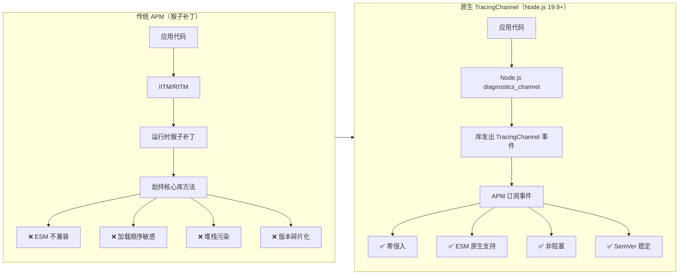
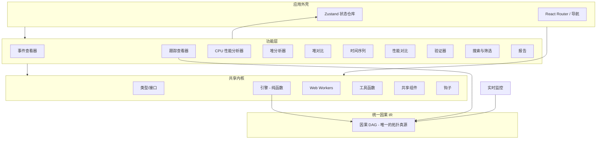

# NodeVerdict

> 一款基于浏览器的 **Node.js 诊断数据查看工具**。它消费 Node.js 原生 `diagnostics_channel.TracingChannel` 输出的 JSON 事件，提供事件列表、瀑布图、CPU 火焰图、堆快照分析、GC 日志解析、性能对比和报告生成等功能。所有数据在本地处理，不上传任何服务器。项目包含一个可选的 WebSocket Live Agent，用于从运行中的 Node.js 进程实时采集诊断数据。适用于开发阶段调试和 TracingChannel 生态的工具验证场景。


[](LICENSE)
[](https://snowleopard-io.github.io/NodeVerdict/)

---

## 目录

- [为什么选择 NodeVerdict](#为什么选择-nodeverdict)
- [特性](#特性)
- [快速开始](#快速开始)
- [使用指南](#使用指南)
- [更多能力](#更多能力)
- [架构](#架构)
- [示例](#示例)
- [浏览器支持](#浏览器支持)
- [开发](#开发)
- [常见问题](#常见问题)
- [生态与时机](#生态与时机)
- [许可证](#许可证)

---

## 为什么选择 NodeVerdict

Node.js 可观测性生态正在经历一场**基础设施层面的范式转变**。现有的 APM 工具依赖 `import-in-the-middle`（IITM）和 `require-in-the-middle`（RITM）对库进行猴子补丁——这种方式脆弱且不兼容 ESM、与打包工具冲突，且需要在任何库加载之前初始化 SDK。

自 Node.js 19.9 起，内置的 `diagnostics_channel.TracingChannel` API 允许库原生发出结构化的 `start`/`end`/`asyncStart`/`asyncEnd`/`error` 事件。APM 工具可以直接订阅——无需任何补丁。

**NodeVerdict 正是为这一迁移而构建。** 当主流库（mysql2、ioredis、pg、Express 等）原生支持 TracingChannel 时，社区需要一个交互式前端来消费和可视化这些诊断事件。生态的生产侧正在快速建设中；而消费侧仍是一片空白。



---

## 特性

### 1. 诊断事件查看器

上传 TracingChannel 事件的 JSON 文件，在交互式时间线中探索它们。

- **时间线视图** — 按时间顺序排列的事件列表，带颜色编码的通道标记
- **通道筛选** — 按通道名称筛选（如 `mysql2:query`、`ioredis:command`）
- **事件详情面板** — 点击任意事件查看完整上下文，支持智能渲染（SQL 语法高亮、HTTP 方法徽章、错误堆栈跟踪、Redis 命令展示）
- **操作聚合** — 配对的 `start`/`end` 事件显示完整操作耗时和状态


### 2. 跟踪瀑布图

使用 `asyncStart`/`asyncEnd` 事件可视化异步操作链。

- **瀑布图** — 基于 D3.js 的水平条形图，展示嵌套的异步操作，类似 Chrome DevTools 的 Performance 面板
- **依赖关系图** — 操作之间的因果关系（例如"查询 A 等待连接池 → 连接建立 → 查询执行"）
- **瓶颈检测** — 自动识别 P95+ 慢操作


### 3. CPU 性能分析器（新增）

上传来自 Node.js（`--cpu-prof`）或 Chrome DevTools 的 `.cpuprofile` 文件，可视化 CPU 使用情况。

- **交互式火焰图** — 基于 D3.js 的火焰图，支持点击缩放、悬停提示和缩放历史导航
- **热点函数表** — 可按自身耗时或总耗时排序，展示命中次数和源文件位置
- **调用栈可视化** — 完整的调用树遍历，用彩色函数块按 CPU 时间比例展示
- **真实示例数据** — 包含 `examples/cpu-profile-sample.cpuprofile`，模拟典型 Express 应用流量模式


### 4. 堆快照分析器

上传来自 Node.js 的 `.heapsnapshot` 文件进行内存分析。

- **热点对象列表** — 按保留大小排序的顶级对象
- **泄漏检测** — 三条规则自动标记可疑对象：无界缓存增长、闭包捕获大对象、事件监听器累积
- **GC 根路径** — 从 GC 根到选定对象的简化路径展示


### 5. 堆快照对比（新增）

并排比较两个 `.heapsnapshot` 文件，识别内存增长和新对象。

- **双面板上传** — 独立上传"前"和"后"快照
- **差异摘要卡片** — 前后大小、大小差异、对象差异
- **新增 / 增长 / 移除** — 三个分类列表，展示新创建的对象类型、增长的构造函数和释放的类型
- **完整差异表** — 按绝对大小差异排序，展示每个构造函数类型的数量和大小变化


### 6. 时间序列分析（新增）

可视化事件吞吐量、延迟分布和随时间的性能趋势。

- **吞吐量图表** — 基于 D3.js 的柱状图，展示每个时间桶内的事件数量，错误标记用红色叠加
- **延迟分布** — 直方图展示操作耗时分布（30 个桶）
- **通道延迟分解表** — 每个通道的 P50、P95、P99、最小值、最大值和平均延迟
- **摘要指标** — 每秒事件吞吐量、平均延迟、P95 延迟


### 7. 性能对比（新增）

比较两组跟踪数据，识别性能回退或改进。

- **双数据集上传** — 加载"前"和"后"跟踪事件 JSON 文件
- **并排统计** — 每个数据集的事件数、操作数、错误率和总耗时
- **通道对比表** — 按通道对比平均延迟、差异、百分比变化和错误数量
- **可视化指示器** — 红色表示回退（慢 >5%），绿色表示改进（快 >5%）


### 8. 事件验证器

为库维护者和 APM 工具开发者提供，用于验证 TracingChannel 实现的正确性。

- **命名规范检查** — 验证 `{package}:{operation}` 格式
- **必填字段验证** — 确保上下文包含语义字段（如 `db.query.text`、`server.address`）
- **事件配对检查** — 验证每个 `start` 都有匹配的 `end`/`error`
- **兼容性检查** — 验证与 OpenTelemetry 语义约定的一致性


### 9. 搜索与筛选（新增）

在所有跟踪事件中进行高级搜索和筛选。

- **全文搜索** — 搜索通道、上下文和 operationId 字段
- **正则表达式支持** — 切换正则模式进行高级模式匹配
- **大小写切换** — 控制大小写敏感性
- **耗时范围筛选** — 按最小/最大耗时筛选操作
- **状态筛选** — 按成功、错误或不完整操作筛选
- **时间范围筛选** — 数值时间戳范围筛选
- **实时结果** — 匹配事件数与总事件数的实时计数


### 10. 可分享的诊断报告

生成压缩报告并编码到 URL 中——通过 GitHub Issues、Slack 或文档分享。

- **零基础设施** — 报告使用 `lz-string` 压缩编码在 URL 哈希中
- **一键复制** — 单击按钮即可复制可分享链接
- **关键发现** — 自动生成的摘要（如"mysql2:query 平均 120ms，P95 450ms"）
- **离线 HTML 导出（新增）** — 下载独立的 HTML 文件，包含所有数据和图表，样式如同专业报告，无需服务器即可查看


### 11. 内存时间线（新增）

上传 `process.memoryUsage()` 时间序列数据，可视化随时间变化的内存增长趋势。

- **D3.js 折线图** — 三条叠加线条（RSS、heapUsed、external），带相对时间轴（秒）和 MB 单位
- **增长率告警** — 线性回归计算检测异常内存增长（>1 MB/s 标记为异常）
- **数据表格** — 所有内存快照的可滚动详情表格，便于精确查看


### 12. GC 日志分析器（新增）

解析 V8 `--trace-gc` 日志文件，分析垃圾回收行为和外部内存压力。

- **GC 统计卡片** — GC 总次数、Major（Mark-sweep）次数、Minor（Scavenge）次数、总暂停时间
- **外部内存警告** — 标记堆增长 >50MB 为潜在未管理内存
- **事件表格** — 所有 GC 事件按时间排序，包含类型、暂停时间和堆大小变化


### 13. 实时监控（新增）

通过 WebSocket 实时连接到正在运行的 Node.js 进程——无需重启，无需转储文件。

- **实时内存轮询** — RSS、heapUsed、heapTotal、external 在实时更新的统计卡片上展示
- **实时 TracingChannel 事件** — 流式事件展示，带通道徽章和时间戳
- **按需诊断** — 随时获取堆快照或 CPU 性能分析文件，并下载为文件
- **代理协议** — 使用 `NodeVerdict Live Agent`（`server/live-agent.mjs`），该代理订阅 `diagnostics_channel` 事件和 inspector API


### 14. 告警规则（新增）

定义基于追踪/堆指标阈值规则，并实时查看哪些规则正在触发。

- **六种指标** — `heapUsedPercent`（%）、`externalMemory`（MB）、`heapGrowthRate`（MB/s）、`rssGrowthRate`（MB/s）、`errorRate`（%）、`eventRate`（evt/s）
- **三个级别** — `info` / `warning` / `critical`，带颜色徽章、边框高亮；规则被违反时进入"触发"状态并点亮
- **规则构建器** — 添加/删除规则（指标 + 比较运算符 + 阈值 + 级别）；默认内置一条规则（`heapUsedPercent > 85`，warning）
- **最近触发** — 规则基于当前指标快照实时评估；每条触发规则都会列出实际值与消息，并可一键清除


### 15. 教程

内置交互式指南，涵盖如何从 Node.js 项目生成诊断数据以及如何使用所有 NodeVerdict 功能。

- **基于 Markdown** — 分步说明，包含 TracingChannel、CPU 性能分析、堆快照等代码示例
- **功能讲解** — 应用中每个页面的详细使用指南
- **示例文件参考** — 全部 17 个示例文件的完整表格及推荐学习路径


### 16. AI 根因分析（新增）

一键根因诊断，由大模型驱动（未配置 API 密钥时回退到本地启发式分析）。

- **追踪转提示词** — 将任意追踪数据转为紧凑的结构化提示词，保留跨度拓扑、耗时占比和错误链
- **生态感知推理** — 系统提示词内置 Node.js 知识库（连接池、事件循环阻塞、N+1、Redis KEYS 等），让模型依据真实库行为推理
- **流式输出** — 分析以 Markdown 形式实时流入页面
- **自带密钥** — 兼容任意 OpenAI 格式端点；密钥仅保存在浏览器 localStorage
- **本地回退** — 启发式分析器（高成本频道、最深错误、最耗时跨度）零配置即可用


### 17. OpenTelemetry 导入与 .ndv 二进制格式（新增）

- **OTel 原生** — 直接放入标准 OTLP/JSON 追踪导出（或 jaeger 风格 JSON），所有页面自动识别并转换为其内部事件模型。无需 Jaeger/采集器。
- **紧凑 `.ndv` 格式** — 将追踪导出为内存映射友好的二进制格式（约为 JSON 体积的 45%）。追踪查看器可导入/导出 `.ndv`；该布局设计为让 Rust/WASM 解码器可直接读取同一缓冲区。
- **统一加载器** — 一个加载器即可在全部功能中规范化三种来源（NodeVerdict JSON、OTel JSON、`.ndv`）。

### 18. 性能门禁 CLI（新增）

把追踪数据变成 CI 门禁。

- **`node-verdict check`** — 带退出码（`0` 通过、`1` 失败、`2` 错误）的 CLI，便于接入 CI
- **规则即代码** — P99 延迟、N+1 SQL 模式、事件循环延迟的可配置阈值
- **GitHub Actions** — `.github/workflows/perf-gate.yml` 在每次 PR 上运行门禁，并将差异报告发布为 PR 评论
- **输出** — 人类可读的 Markdown 或供机器解析的 `--json`

### 19. NodeVerdictExporter SDK（新增）

将运行中 Node.js 服务的 OTel 跨度直接流式送入查看器。

- **`nodeverdict-exporter`** — 将完成的跨度转换为 NodeVerdict `TracingEvent[]` 并流式转发到回调的 OpenTelemetry `SpanProcessor` / `SpanExporter`
- **一行式配置** — `startNodeVerdict({ serviceName, onExport })` 注册全局 `NodeTracerProvider`
- **格式** — 原生事件 JSON 或 OTLP/JSON 输出，浏览器可直接导入
- 完整指南见 [`exporter/README.md`](./exporter/README.md)。

### 20. 服务拓扑与分布式根因分析（新增）

在浏览器中把跨服务 OTel 追踪变为实时依赖地图与排序后的根因结论。

- **跨度树重建** — 从 OTel 导出中解析 `trace_id` / `span_id` / `parent_span_id` 并按追踪重建跨度树；安全处理多追踪间的跨度 ID 复用
- **逻辑时钟偏斜校正** — 以 Lamport 风格重新锚定修正跨主机墙钟漂移（保留耗时、强制因果），即使在毫秒级时钟偏斜下事件顺序也可信
- **服务依赖图** — 节点为服务、边为调用方→被调用方，聚合调用频率、P50/P95/P99 延迟与错误率；节点按健康 / 警告 / 故障着色
- **力导向渲染** — 基于 D3-force 在 `<canvas>` 上仿真绘制（图较大时悬停显示标签），100+ 服务仍保持 60fps；点击节点可查看指标与依赖
- **根因定位** — 综合关键路径分析、无法解释自耗时异常检测、错误信号与依赖图上的反向个性化 PageRank，生成带**置信度**的排序假设列表
- **级联影响链** — 展示因果链（"服务 A 延迟 ↑ → 服务 B 超时 → 服务 C 队列积压"）与可执行的修复建议（如连接池耗尽）
- **与追踪查看器联动** — "在追踪查看器中打开"可直接跳转到同一数据集的现有瀑布图


### 21. 微分调试（新增）

对比同一代码路径的**正常**与**故障**执行轨迹，精确定位两次运行在哪一点、因何而分叉 —— 相当于执行轨迹的 git diff。

- **带状对齐** — 事件流以带约束的动态规划编辑距离对齐（先裁剪公共前缀/后缀，内存 O(band)），10 万事件轨迹可在 1 秒内完成对齐
- **忽略运行性噪声** — 默认排除时间戳、请求/追踪/跨度/会话 ID、`now()`/`hrtime` 等字段，避免无关差异产生误报分叉
- **原因 vs. 结果** — 首个分叉区域被分类为**原因**，其后同通道或携带错误的分叉区域为**结果**，均附 0–1 置信度与可读原因
- **变量与调用栈差异** — 每个分叉点并排展示对齐事件对、逐键变量差异与逐帧调用栈差异
- **自然语言报告** — 自动生成摘要与有序修复建议（例如"故障运行读取 512 字节而正常运行为 1024 字节 —— 请检查数据库连接池配置"）


- **JIT Insights** — 解析合并的 V8 `--trace-ic` / `--trace-opt` / `--trace-deopt` 输出为内联缓存站点、隐藏类（map）流转与优化/反优化时间线；以力导向图可视化 IC 多态；检测 JIT 反模式（超态 IC、反优化风暴、优化/反优化循环、隐藏类碎片化、优化被抑制），按严重度打分并给出整体健康度。语义补丁引擎重排对象字面量 / 字段初始化顺序以统一隐藏类，每个补丁均由基于 `@babel/parser` 的 AST 等价性校验确认；并提供完整的端到端流程，将每条反模式映射回你上传源码中对应的函数，应用经 AST 校验的修复并下载重写后的文件。示例日志/源码：`examples/v8-jit-trace.log` + `examples/demo.js`。


### 23. 快照历史（新增）

追踪堆快照对比结果随时间的变化趋势，识别内存增长模式。在 Heap Diff 视图中保存的每次对比都会被记录为一条历史记录，让你可以观察多次快照之间保留大小、节点数与增长率的演变。

- **趋势折线图** — d3 绘制的保留大小增量趋势图，红色为增长点、绿色为改善点，并带虚线零线
- **泄漏模式检测** — 单调增长的记录被标记为**内存泄漏**，缩小的记录标记为健康，并自动生成模式描述
- **汇总统计** — 总对比次数、平均增长率、新增节点总数与标记为泄漏的记录数
- **完整历史表格** — 每条记录的 ID、时间戳、标签、对比前后大小、保留 Δ 与增长率
- **导入 / 清除** — 导入历史记录文件（例如 `examples/snapshot-history.json`）以载入既往运行数据，或清除全部记录


### 24. 流式因果图重建（新增）

把一条可能是扁平、断裂的 TracingChannel 事件流，重建为**因果 DAG** —— 关注"为什么发生"，而不仅是"何时发生"。

- **流式 / 增量** — `CausalGraphBuilder.ingest()` 逐条接收事件（Live agent、流式 worker）；`build()` 可在 trace 到达过程中反复调用，因此随时都能得到一份部分可用的图
- **因果关系，而非时间顺序** — 边来自显式父 id（`parentOperationId`/`parentSpanId`）、`asyncId`→`triggerAsyncId` 匹配，或区间包含；乱序到达会被重新配对而非拒绝
- **置信度 + 缺口修复** — 每条边带 `high`/`medium`/`low` 置信度；缺失的祖先被回填为*虚拟*节点，拓扑保持连通而不虚构真实操作
- **环检测** — 合法的因果 DAG 无环；DFS 找回边，标记相关节点并报告环
- **孤儿语义** — 仅当*声明的*关系被破坏（缺少父节点 / 有始无终）时才视为孤儿；真正的根节点不是孤儿

### 25. 实时流式 RCA（新增）

在*部分*数据上进行的根因推断 —— 数据仍在流入时结论就已到达，且不确定性被显式呈现。

- **增量定责** — 在部分 DAG 上做定点影响传播（child→parent），由各节点异常评分引导；每个快照重算 O(边数)
- **时间滑动窗口** — 每个样本带结束时间戳；只有 `[now − windowMs, now]` 计入"近期"，因此延迟/错误尖峰以全时基线为对照
- **信号** — `latency-spike`（自身时长 vs 25 分位基线）、`error-rate-spike`（窗口 vs 全时错误占比）、`high-error-count`、`incomplete-open-span`
- **不确定性标注** — 未闭合 span 携带降权置信度；整体置信度随已闭合证据累积而升高
- **早期预警** — 在图形成前，先发出粗粒度 通道级 `critical`/`warning` 告警

### 26. Trace 到代码反向映射（新增）

把每个堆栈帧映射回*原始*源码 —— 不再需要手动翻 `node_modules/...:234:5`。

- **Source Map V3 解析器** — 无依赖 base64-VLQ 解码器（`src/shared/source/source-map-resolver.ts`），支持正向（generated→original）与反向（original→generated）查询
- **V8 堆栈解析** — 同时处理 `at fn (file:line:col)` 与裸 `at file:line:col` 两种形式
- **Node.js C++ / 内置过滤** — `node::...`、`* internalBinding *`、`node:internal/...`、`[eval]` 帧被*突出*而非隐藏，`node_modules` 视作应用代码
- **文件系统访问桥** — 选一次项目根目录，按需读取 `.map` 文件；在不支持的环境下退化为 no-op 桩

### 27. 弹性对齐与噪声抑制（新增）

同样的代码跑两次仍会因 GC 暂停、DNS/TCP 建立、定时器抖动而不同。本层在产出任何结论*之前*把"抖动"与"回归"分开。

- **噪声模型** — `src/shared/differential/noise-model.ts` 每条 trace 独立检测并屏蔽 GC 暂停、定时器抖动、DNS/TCP 建立与大段空闲事件间隙
- **语义差异器** — 丢弃被屏蔽的差异与琐碎的纯数值变更；保留错误引入 / 栈变更 / 新增 / 缺失 / 通道序列（路径改变）差异
- **回归评分** — `severity = confidence × impact`：置信度是结构性变更的占比，影响融合平均显著性与通道广度；`minDeltaMs` 提供第二道抗噪下限
- **向后兼容** — 传 `{ regression: {} }` 给 `analyzeDifferential` 时启用完整管线；不传则行为不变

### 28. 视口剔除虚拟滚动瀑布图（新增）

瀑布图不再是一张会在 10 万 span 时卡死的 `N × 节点数` SVG。

- **视口剔除** — 只渲染 `[scrollTop, scrollTop + viewportHeight]` 内的行（外加 overscan 缓冲）；DOM 数 O(可见)，与总 span 数无关
- **零视觉变化** — 仍是 D3 SVG，观感不变；底部小字显示 `显示 {shown} / {total} 个 span（视口）`
- **刻意收窄** — 只做行虚拟化；不做 WebGL/Canvas 重写、不做 LOD 降采样（瀑布图的瓶颈是行数，不是横向密度）

---

## 更多能力

### 29. CPU 性能剖析对比（新增）

对比两个 CPU profile，查看不同构建或版本之间哪些热点变大、变小或消失。 

- **双向火焰图对比** — 直接对比两个 profile 的热点差异
- **函数级别增删改摘要** — 快速定位回退或优化的函数
- **更适合回归排查** — 适合在发布前验证性能变化

### 30. 源码归因（新增）

将热点操作或失败操作映射回其对应的源文件和函数。 

- **追踪到源码的关联** — 把堆栈和诊断事件关联到作者代码
- **Source Map 支持** — 支持 V3 source map 与项目根目录解析
- **更快定位问题** — 帮助把问题缩小到应用代码，而不是依赖内部实现

### 31. OTel 持续摄入（新增）

持续接收 OpenTelemetry 批次数据，并直接在浏览器中重建拓扑与健康状态。 

- **流式批次输入** — 随时间处理传入的 OTel 导出
- **实时拓扑更新** — 随数据到达动态重算服务依赖和健康状态
- **适合持续观测与故障排查** — 适用于长期监控和事故现场分析

### 32. 报告对比（新增）

将两个生成的诊断报告并排比较，快速理解两次运行之间发生了什么变化。 

- **按通道对比差异** — 检查延迟、错误和活动模式的变化
- **堆内存与错误率对比** — 直观识别回退点
- **适合 PR / 发布 / 事故复盘** — 帮助快速做结论判断

### 33. CI 基线（新增）

把 NodeVerdict 用作 CI 中可复用的性能基线和门禁层。 

- **可复用的性能门禁** — 在不同分支和构建上复用统一阈值
- **基线报告生成** — 将当前运行与已知良好基线对比
- **更适合 PR 级别回归检查** — 在代码上线前暴露性能问题

### 34. 复现脚本生成器（新增）

把一段追踪数据中最热点的部分导出成一个自包含的 Node.js 复现脚本。 

- **最小复现脚本导出** — 把大型追踪缩减为聚焦的小型复现案例
- **更便于分享和排查** — 易于离线复现和问题转发
- **更快形成结论** — 帮助把嘈杂追踪变成清晰的复现路径

---

## 快速开始

### 前提条件

- Node.js 18+
- npm 9+

### 安装

```bash
git clone https://github.com/your-username/node-verdict.git
cd node-verdict
npm install
```

### 开发

```bash
npm run dev
```

在浏览器中打开 [http://localhost:5173/node-verdict/](http://localhost:5173/node-verdict/)。

### 生产构建

```bash
npm run build
npm run preview
```

静态构建输出在 `dist/` 目录中，可直接部署到 GitHub Pages 或任何静态托管服务。

---

## 使用指南

### 1. 准备诊断数据

TracingChannel 事件应导出为 JSON 数组。每个事件遵循以下结构：

```typescript
interface TracingEvent {
  channel: string;           // 例如："mysql2:query"
  eventType: 'start' | 'end' | 'asyncStart' | 'asyncEnd' | 'error';
  context: Record<string, any>;  // 库特定的上下文
  timestamp: number;
  duration?: number;
  error?: { message: string; stack?: string; name?: string };
  operationId?: string;      // 用于跨事件关联
}
```

CPU 性能分析文件应使用 `--cpu-prof` 标志从 Node.js 导出，或使用 Chrome DevTools 的 CPU 性能分析导出功能。

堆快照应使用 `node --heapsnapshot-signal` 或 `v8.writeHeapSnapshot()` 生成。

### 2. 上传与探索

导航到任意功能页面，上传诊断文件，开始探索：

| 页面 | 数据类型 | 最佳用途 |
|------|----------|----------|
| **事件查看器** | Tracing 事件 JSON | 浏览单个事件、按通道筛选、智能上下文检查 |
| **跟踪查看器** | Tracing 事件 JSON | 理解异步操作链和瓶颈 |
| **CPU 性能分析器** | `.cpuprofile` | 查找热点函数、火焰图可视化 |
| **堆分析器** | `.heapsnapshot` | 内存泄漏调查、热点对象分析、字符串分析 |
| **堆对比** | `.heapsnapshot`（×2） | 对比前后内存以发现增长 |
| **时间序列** | Tracing 事件 JSON | 随时间变化的吞吐量和延迟分布 |
| **性能对比** | Tracing 事件 JSON（×2） | A/B 性能对比、回退检测 |
| **验证器** | Tracing 事件 JSON | 调试 TracingChannel 库实现 |
| **搜索与筛选** | Tracing 事件 JSON | 全文搜索、正则表达式、耗时/状态筛选 |
| **报告** | Tracing 事件 JSON | 生成可分享的诊断摘要 |
| **内存时间线** | `memory-timeline.json` | 可视化 RSS/堆/外部内存增长趋势 |
| **GC 日志分析器** | `--trace-gc` 日志文件 | 分析 GC 暂停时间和外部内存压力 |
| **实时监控** | WebSocket（实时） | 实时内存监控、按需堆/CPU 诊断 |
| **告警规则** | Tracing 事件 JSON / 堆数据 | 阈值监控（内存占比、增长率、错误率/事件率） |
| **AI 根因分析** | Tracing 事件 JSON / OTel / `.ndv` | 大模型或本地启发式根因分析 |
| **教程** | 内置 MD 指南 | 学习如何生成和使用诊断数据 |

### 3. AI 根因分析

一键诊断追踪数据：

1. **上传追踪数据** — NodeVerdict `TracingEvent[]` JSON、OpenTelemetry 导出或 `.ndv` 文件均可。
2. 点击 **AI 诊断**。首次使用会打开 **配置 API 密钥** 弹窗——填写任意 OpenAI 格式端点（Base URL）、模型与 API 密钥。密钥仅保存在浏览器 localStorage，并直接发送到该端点。
3. 分析**以 Markdown 流式输出**——症状、关键证据、根因、修复建议（基于内置 Node.js 生态知识库）与置信度。
4. 没有 API 密钥？点击 **本地启发式分析**——零配置即可输出成本最高的频道、跨度树中最深层的错误以及最耗时的跨度。

> 隐私：只有你主动发送的追踪摘要会离开浏览器，原始数据始终留在本地。

### 4. 性能门禁（CI）

在命令行用性能规则检查追踪数据：

```bash
npm run build:cli                 # 打包 CLI（npm run build 也会执行）
node cli/check.mjs check examples/tracing-perf-before.json
```

退出码：`0` = 通过，`1` = 失败，`2` = 错误。用配置文件或参数覆盖阈值：

```bash
node cli/check.mjs check examples/tracing-perf-before.json --config gate.json
node cli/check.mjs check trace.ndv --threshold=p99MaxMs=250 --json --report gate-report.md
```

示例 `gate.json`：

```json
{ "p99MaxMs": 500, "n1SqlMaxCount": 3, "eventLoopDelayMaxMs": 20 }
```

内置的 [`.github/workflows/perf-gate.yml`](./.github/workflows/perf-gate.yml) 会在每次 PR 上运行门禁，并把报告发布为 PR 评论。

### 5. 从 OpenTelemetry 流式导入

在 Node.js 服务中使用导出 SDK，然后在任意 NodeVerdict 页面打开输出：

```bash
cd exporter && npm install
```

```ts
import { startNodeVerdict } from 'nodeverdict-exporter';

startNodeVerdict({ serviceName: 'api', onExport: (events) => console.log(JSON.stringify(events)) });
```

也可以把保存好的 OTLP/JSON 导出（或 jaeger 风格 JSON）直接拖入任意页面——加载器会自动识别格式。

### 6. 分享结果

点击 **报告** → **复制链接** 以 URL 形式分享你的分析结果。接收者打开链接即可看到相同的结果——无需服务器，无需安装。

如需更全面的分享，使用 **下载 HTML 报告** 按钮导出独立的、自包含的 HTML 报告文件。

---

## 架构

```
src/
├── shared/                          # 内核（框架无关）
│   ├── types/                       # TypeScript 类型定义
│   │   ├── tracing.ts               # TracingChannel 事件类型
│   │   ├── heap.ts                  # 堆快照类型
│   │   ├── cpu-profile.ts           # CPU 性能分析及火焰图类型
│   │   ├── memory.ts                # 内存分析类型
│   │   └── report.ts                # 报告数据类型
│   ├── engine/                      # 流水线解析引擎（纯函数）
│   │   ├── tracing-parser.ts        # Tracing 事件解析流水线
│   │   ├── trace-aggregator.ts      # 瀑布图构建及瓶颈检测
│   │   ├── data-loader.ts           # 统一加载器：NodeVerdict JSON / OTel / .ndv
│   │   ├── otel-adapter.ts          # OTLP/JSON → TracingEvent 转换
│   │   ├── ndv-codec.ts             # 紧凑 .ndv 二进制编解码器（WASM 就绪布局）
│   │   ├── heap-parser.ts           # 堆快照解析
│   │   ├── heap-diff.ts             # 堆快照对比引擎
│   │   ├── memory-analyzer.ts       # 字符串/外部内存/GC 日志分析
│   │   ├── cpu-profile-parser.ts    # CPU 性能分析解析及火焰树构建
│   │   ├── validator.ts             # 事件格式验证器
│   │   ├── report-generator.ts      # 报告生成与压缩
│   │   ├── causal-rebuilder.ts      # 流式因果 DAG 构建器（功能 24）
│   │   └── jit-analysis.ts          # V8 IC / deopt / 隐藏类分析
│   ├── streaming/                   # 实时 / 增量分析
│   │   └── streaming-rca.ts         # 部分 DAG 流式 RCA（功能 25）
│   ├── source/                      # 源码与代码映射
│   │   ├── source-map-resolver.ts   # 无依赖 V3 source-map 解码器
│   │   ├── code-linker.ts           # V8 堆栈 → 源码帧链接器
│   │   └── fs-access-bridge.ts      # File System Access API 桥（功能 26）
│   ├── differential/                # A/B 回归分析
│   │   ├── noise-model.ts           # GC/定时器/DNS 噪声抑制（功能 27）
│   │   ├── semantic-differ.ts       # 语义差异过滤
│   │   └── regression-scoring.ts    # 置信度 × 影响 回归评分
│   ├── ai/                          # AI 根因引擎
│   │   ├── tracePrompt.ts           # 追踪转提示词转换器
│   │   ├── rcaEngine.ts             # LLM 客户端 + 本地启发式分析器
│   │   └── knowledge.ts             # Node.js 生态最佳实践知识库
│   ├── gate/                        # CI 性能门禁规则引擎（与 CLI 共享）
│   │   └── performance-gate.ts      # 指标 + 规则 + 报告格式化
│   ├── workers/                     # Web Worker 工厂及处理器
│   ├── utils/                       # 格式化、I/O、辅助工具
│   ├── components/                  # 共享 UI 组件
│   └── hooks/                       # 共享 React 钩子
├── features/                        # 功能模块（自包含）
│   ├── event-viewer/                # 诊断事件查看器
│   ├── trace-viewer/                # 瀑布图及瓶颈分析
│   ├── cpu-profiler/                # CPU 性能分析及火焰图
│   ├── heap-analyzer/               # 堆快照分析器（含字符串/外部内存）
│   ├── heap-diff/                   # 堆快照对比
│   ├── time-series/                 # 时间序列及吞吐量分析
│   ├── perf-compare/                # A/B 性能对比
│   ├── memory-timeline/             # 内存使用时间线图表
│   ├── gc-log/                      # GC 日志解析器及分析器
│   ├── live-monitor/                # 实时 WebSocket 代理监控
│   ├── validator/                   # 事件格式验证器
│   ├── search-filter/               # 高级搜索与筛选
│   ├── tutorial/                    # 交互式 Markdown 教程
│   └── report/                      # 报告生成与分享
├── stores/                          # Zustand 状态管理
└── app/                             # 应用外壳、入口点、导航
```



### 关键设计模式

| 模式 | 描述 |
|---------|------|
| **流水线引擎** | `标准化 → 配对 → 统计 → 索引` — 每个阶段都是纯函数，可独立测试 |
| **统一因果 IR** | 因果 DAG 是唯一的拓扑真源——瀑布 span 与父子依赖链接都由其边派生（每条边带 `edgeKind`/`edgeConfidence`），而非各自的 containment 启发式 |
| **状态切片** | 每个功能在中央 Zustand 仓库中注册自己的切片——无循环依赖 |
| **Worker 工厂** | 从处理器函数生成类型安全的泛型 Worker 客户端 |
| **功能隔离** | 每个功能拥有自己的组件和逻辑，仅通过状态仓库共享 |

---

## 示例

示例数据文件位于 [`examples/`](./examples) 目录中：

| 文件 | 描述 | 尝试于 |
|------|------|--------|
| `examples/tracing-events.json` | mysql2 + ioredis 混合事件，包含死锁错误 | 事件查看器、跟踪查看器 |
| `examples/tracing-multi-lib.json` | pg + KafkaJS + Express 跨库跟踪 | 跟踪查看器、报告 |
| `examples/tracing-invalid.json` | 异常数据：孤立事件、重复开始、错误命名 | 验证器 |
| `examples/tracing-http-errors.json` | HTTP 错误场景（404/403/400/500、超时、负载过大） | 事件查看器、验证器、报告 |
| `examples/tracing-search-filter.json` | 8 个通道上 40+ 事件：不同耗时、错误和状态，用于搜索/筛选测试 | 搜索与筛选、事件查看器 |
| `examples/tracing-cross-lib.json` | 复杂的跨库异步链：Express → Auth → Redis → MySQL → Kafka | 跟踪查看器、事件查看器 |
| `examples/tracing-time-series.json` | 14 个操作的时间戳分散事件，用于吞吐量和延迟分布分析 | 时间序列、事件查看器 |
| `examples/tracing-perf-before.json` | 基线跟踪数据：5 个请求，未优化的查询（慢 JOIN、SELECT *、无缓存） | 性能对比、跟踪查看器 |
| `examples/tracing-perf-after.json` | 优化版本：查询改进、列选择、7 天筛选，延迟降低约 40-50% | 性能对比、跟踪查看器 |
| `examples/cpu-profile-sample.cpuprofile` | 400 样本 CPU 性能分析，模拟带数据库查询、认证和缓存的 Express 应用 | CPU 性能分析器 |
| `examples/heap-sample.heapsnapshot` | 最小 5 节点堆快照链（AppCache → DataStore → SessionManager → LargeBuffer） | 堆分析器 |
| `examples/heap-express-app.heapsnapshot` | 真实的 Express 应用堆：闭包、事件监听器、大缓冲区、缓存条目 | 堆分析器、堆对比 |
| `examples/heap-diff-before.heapsnapshot` | 前快照：11 个节点，小缓存（2 条目）和会话存储 | 堆对比 |
| `examples/heap-diff-after.heapsnapshot` | 后快照：18 个节点，增长的缓存（4 条目）+ 泄漏的事件监听器 | 堆对比 |
| `examples/heap-string-leak.heapsnapshot` | 22 节点堆，包含拼接字符串、切片字符串和大字符串缓存，用于测试字符串分析 | 堆分析器 |
| `examples/memory-timeline.json` | 16 个数据点的 process.memoryUsage() 时间序列，展示 15 秒内外部/RSS/堆的稳定增长 | 内存时间线 |
| `examples/memory-timeline-leak.json` | 60 秒 61 个快照的无界会话缓存泄漏：堆 +7.9 MB/s、RSS +10 MB/s（触发异常增长告警） | 内存时间线 |
| `examples/gc-trace-gc.log` | 15 秒内 33 个 GC 事件（Scavenge + Mark-sweep），展示 4 倍堆增长 | GC 日志分析器 |
| `examples/gc-memory-leak.log` | 60 秒渐进式堆泄漏：11 次大 GC 频率持续攀升、暂停不断拉长（平均约 59ms）、增长 +315MB | GC 日志分析器 |
| `examples/otel-distributed-trace.json` | 7 服务 OTel 导出（api → auth → users-db，order → inventory → inventory-db，payment-gateway），含注入的时钟偏斜与 payment-gateway 连接池耗尽故障 | 服务拓扑 |
| `examples/otel-cascade-failure.json` | 12 服务 OTel 导出（2 条结账追踪）的级联故障：payment-gateway 502 + recommendation/cart-db/inventory-db 变慢 → api 500 | 服务拓扑 |
| `examples/tracing-large.json` | 约 42.7 万事件 / 64MB 追踪文件，足以走 Streaming 大文件导入 Worker（≥10MB 自动流式处理） | 流式导入、事件查看器 |
| `examples/differential-normal.json` | 健康运行：5 个 GET /api/users 请求，全部 200，1024 字节 socket 读取 | 微分调试 |
| `examples/differential-fault.json` | 同一代码路径注入数据库连接丢失 bug：请求 req-004 读取 512 字节，抛出 `mysql2:query error`，返回 500 | 微分调试 |
| `examples/differential-timeout-normal.json` | 健康运行：5 个 GET /api/orders 请求，上游调用约 50ms 完成，全部 200 | 微分调试 |
| `examples/differential-timeout-fault.json` | req-004 的上游调用 5000ms 超时 → `TimeoutError`，HTTP 504 | 微分调试 |
| `examples/differential-pool-normal.json` | 6 个 GET /api/orders 请求，各自获取并归还连接池连接 | 微分调试 |
| `examples/differential-pool-fault.json` | req-005 的连接从未归还（泄漏）→ req-006 等待连接超时，HTTP 503 | 微分调试 |
| `examples/differential-cache-normal.json` | GET /api/orders：首个请求预热缓存，后续 4 个命中缓存（无 DB 查询） | 微分调试 |
| `examples/differential-cache-fault.json` | 缓存写入被跳过（bug），每个请求都未命中并打库 —— `cacheHit` 翻转、出现多余查询 | 微分调试 |

### 快速入门指南

**初次接触 NodeVerdict？** 按顺序尝试以下场景：

1. **事件查看器基础** → 上传 `examples/tracing-events.json` 查看时间线
2. **CPU 性能分析** → 上传 `examples/cpu-profile-sample.cpuprofile` 探索火焰图
3. **内存分析** → 上传 `examples/heap-sample.heapsnapshot` 查看泄漏检测
4. **堆对比** → 在堆对比中上传 `examples/heap-diff-before.heapsnapshot` 和 `heap-diff-after.heapsnapshot` 比较内存增长
5. **性能对比** → 在性能对比中上传 `examples/tracing-perf-before.json` 和 `tracing-perf-after.json` 查看优化效果
6. **时间序列** → 上传 `examples/tracing-time-series.json` 可视化吞吐量模式
7. **跨库跟踪** → 在跟踪查看器中上传 `examples/tracing-cross-lib.json` 查看瀑布图
8. **搜索与筛选** → 上传 `examples/tracing-search-filter.json` 测试全文搜索、正则表达式和耗时筛选
9. **分享结果** → 上传任意跟踪数据并进入报告，生成可分享链接或下载 HTML
10. **内存时间线** → 上传 `examples/memory-timeline.json` 可视化外部内存增长及 RSS/堆随时间的变化趋势
11. **GC 日志分析** → 上传 `examples/gc-trace-gc.log` 分析 GC 暂停时间和外部内存压力
12. **字符串泄漏检测** → 在堆分析器中上传 `examples/heap-string-leak.heapsnapshot` 查看外部内存统计和字符串分析
13. **实时监控** → 用 `npm run agent` 启动后端（或 `cd server && npm install && npx nodeverdict-agent`），然后打开实时监控页面——页面会自动检测后端并实时连接 `ws://localhost:9876`。没有后端时页面会显示"需要后端服务器"面板并给出启动命令。连接后可点击 **启动 GC**（流式推送 `node:v8.gc`/堆推断回收事件及回收量）和 **启动泄漏检测**（对活跃集增长或堆上限告警），也可点 **启动火焰图流**（每 `windowMs` 推送一张实时火焰图并即时渲染）。所有告警会显示在"后端告警"条中
14. **告警规则** → 上传任意追踪数据，在告警规则中创建规则（如 `errorRate > 5`，warning），观察规则点亮
15. **AI 根因分析** → 在 AI 根因分析中上传 `examples/tracing-perf-before.json`，点击 **AI 诊断**（无密钥时点击 **本地启发式分析**）
16. **性能门禁** → 在终端运行 `node cli/check.mjs check examples/tracing-perf-before.json --threshold=p99MaxMs=250`，观察门禁失败
17. **二进制导出** → 在跟踪查看器中上传追踪数据，点击 **导出 .ndv（二进制）**，再重新导入该 `.ndv` 文件
18. **OTel 导入** → 把 OTLP/JSON 追踪导出拖入任意页面——会自动识别并转换

---

## 浏览器支持

| 浏览器 | 支持 |
|---------|------|
| Chrome 80+ | ✅ 完整支持 |
| Firefox 80+ | ✅ 完整支持 |
| Safari 14+ | ✅ 完整支持 |
| Edge 80+ | ✅ 完整支持 |

---

## 开发

### 项目脚本

| 命令 | 描述 |
|---------|------|
| `npm run dev` | 启动 Vite 开发服务器，支持 HMR |
| `npm run build` | 打包 CLI + TypeScript 检查 + 生产构建 |
| `npm run build:cli` | 将 `node-verdict` CLI 打包为 `cli/check.mjs` |
| `npm run preview` | 本地预览生产构建 |

### 技术栈

| 组件 | 选择 | 理由 |
|-----------|------|------|
| UI 框架 | React + TypeScript | 稳定的生态系统 |
| 构建工具 | Vite | 快速 HMR，对 GitHub Pages 友好 |
| 样式 | Tailwind CSS v4 | 工具优先，快速 UI 开发 |
| 状态管理 | Zustand | 最少的样板代码，支持切片 |
| 压缩 | lz-string | 对 URL 友好的报告分享 |
| 可视化 | D3.js（火焰图、瀑布图、图表）/ ECharts（概览） | 为每种图表类型量身定制 |

---

## 常见问题

**问：这会把我的数据发送到任何地方吗？**  
答：不会。所有分析完全在浏览器中运行。没有数据被上传到任何服务器。实时监控功能通过 WebSocket 连接到本地代理，但数据始终停留在你的本地网络中。

**问：支持哪些文件格式？**  
答：TracingChannel 事件的 JSON 文件（最大 200MB，通过 Web Worker 流式处理）、标准 OpenTelemetry OTLP/JSON 追踪导出、紧凑的 `.ndv` 二进制格式、用于堆分析的 `.heapsnapshot` 文件（最大 200MB）、用于 CPU 性能分析的 `.cpuprofile` 文件（最大 200MB）、用于内存时间线的 `process.memoryUsage()` JSON 数组，以及用于 GC 分析的 `--trace-gc` 日志文件。

**问：我可以将其用于生产环境监控吗？**  
答：实时监控功能通过 WebSocket 提供实时诊断，无需重启进程——适用于在预发或生产环境中按需调试。对于持久的生产监控，请考虑专用的 APM 工具。

**问：如何从我的 Node.js 应用程序生成 TracingChannel 事件？**  
答：在你的 Node.js 应用程序中订阅 `diagnostics_channel` 通道，并将捕获的事件导出为 JSON。详情请参阅 [Node.js diagnostics_channel 文档](https://nodejs.org/api/diagnostics_channel.html)。

**问：如何生成用于分析的 CPU 性能分析文件？**  
答：使用 `--cpu-prof` 标志运行你的 Node.js 应用程序：`node --cpu-prof app.js`。这会生成一个 `.cpuprofile` 文件。或者，使用 Chrome DevTools 的 Performance 标签 → "Start profiling" → "Download CPU profile"。

**问：如何生成堆快照？**  
答：使用 `node --heapsnapshot-signal=SIGUSR2 app.js` 并发送信号，或在代码中调用 `v8.writeHeapSnapshot()`。生成的 `.heapsnapshot` 文件可以直接加载到 NodeVerdict 中。

**问：堆分析器和堆对比有什么区别？**  
答：堆分析器检查单个快照，查找热点对象和可疑泄漏。堆对比比较两个快照（前后），以发现内存增长、新对象类型和释放的内存。

**问：性能对比功能展示什么？**  
答：它并排比较两组跟踪事件数据集。你可以查看每个通道的延迟变化、错误率差异和总体耗时差异——适用于 A/B 测试性能优化效果。

**问：可以使用正则表达式跨事件搜索吗？**  
答：可以。搜索与筛选页面支持正则表达式模式、大小写切换、耗时范围、状态筛选和时间范围筛选。

**问：离线 HTML 报告包含哪些信息？**  
答：导出的 HTML 报告包含关键发现、按通道统计（操作数、平均耗时、P95、错误数）、堆分析摘要（如有）以及专业样式——全部在一个独立的自包含文件中。

---

## 生态与时机

TracingChannel API 自 Node.js 18 起就已可用，但真正有意义的生态采用始于 2025 年底。主要库的迁移状态：

| 库 | 状态 | 周下载量 |
|---------|------|----------|
| mysql2 | ✅ 已合并（v3.20.0） | ~6000 万+ |
| node-redis | ✅ 已合并 | ~6000 万+ |
| ioredis | ✅ 已合并 | ~6000 万+ |
| pg（PostgreSQL） | 🔄 PR 已提交 | 主流 |
| Express | 🔄 PR 已提交 | 主流 |
| GraphQL | 🔄 PR 已提交 | 主流 |
| 跟踪 44+ 个库 | 10 个已合并，4 个 PR 已提交，8 个讨论中，22 个未开始 | |

**关键洞察**：当 mysql2 推出 TracingChannel 支持后，社区独立构建了 `mysql2-otel-instrumentation`——一个纯粹的 `diagnostics_channel` 订阅者，取代了猴子补丁式的 `@opentelemetry/instrumentation-mysql2`。这表明一旦库原生支持 TracingChannel，订阅者生态会自然涌现——但用于调试和可视化这些事件的工具仍然缺失。

---

## 许可证

[MIT](LICENSE)

---

## 贡献

欢迎贡献！如有任何错误、功能或改进，请提交 Issue 或 PR。